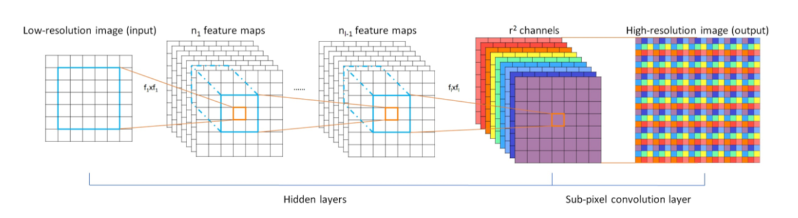

# ESPCN

This repository is implementation of the ["Real-Time Single Image and Video Super-Resolution Using an Efficient Sub-Pixel Convolutional Neural Network"](https://arxiv.org/abs/1609.05158).

<center></center>

## Requirements

- PyTorch 1.1.0
- Numpy 1.15.4
- Pillow 6.0.0
- h5py 2.8.0
- tqdm 4.30.0

## Train

The 91-image, Set5 dataset converted to HDF5 can be downloaded from the links below.

| Dataset | Scale | Type | Link |
|---------|-------|------|------|
| 91-image | 3 | Train | [Link](/BLAH_BLAH/) |
| Set5 | 3 | Eval | [Link](/BLAH_BLAH/) |

Otherwise, you can use `prepare.py` to create custom dataset.

```bash
bash run.sh               
```

## Test

Pre-trained weights can be downloaded from the links below.

| Model | Scale | Link |
|-------|-------|------|
| ESPCN (91) | 3 | [Link](/BLAH_BLAH/outputs/x3/best.pth) |

The results are stored in the same path as the query image.

```bash
bash run.sh
```

## Results

PSNR was calculated on the Y channel.

### Set5

| Eval. Mat | Scale | Paper (91) | Ours (91) |
|-----------|-------|-------|-----------------|
| PSNR | 3 | 32.55 | 32.88 |

<table>
    <tr>
        <td><center>Original</center></td>
        <td><center>BICUBIC x3</center></td>
        <td><center>ESPCN x3 (23.84 dB)</center></td>
    </tr>
    <tr>
    	<td>
    		<center></center>
    	</td>
    	<td>
    		<center></center>
    	</td>
    	<td>
    		<center></center>
    	</td>
    </tr>
    <tr>
        <td><center>Original</center></td>
        <td><center>BICUBIC x3</center></td>
        <td><center>ESPCN x3 (25.32 dB)</center></td>
    </tr>
    <tr>
    	<td>
    		<center></center>
    	</td>
    	<td>
    		<center></center>
    	</td>
    	<td>
    		<center></center>
    	</td>
    </tr>  
</table>
